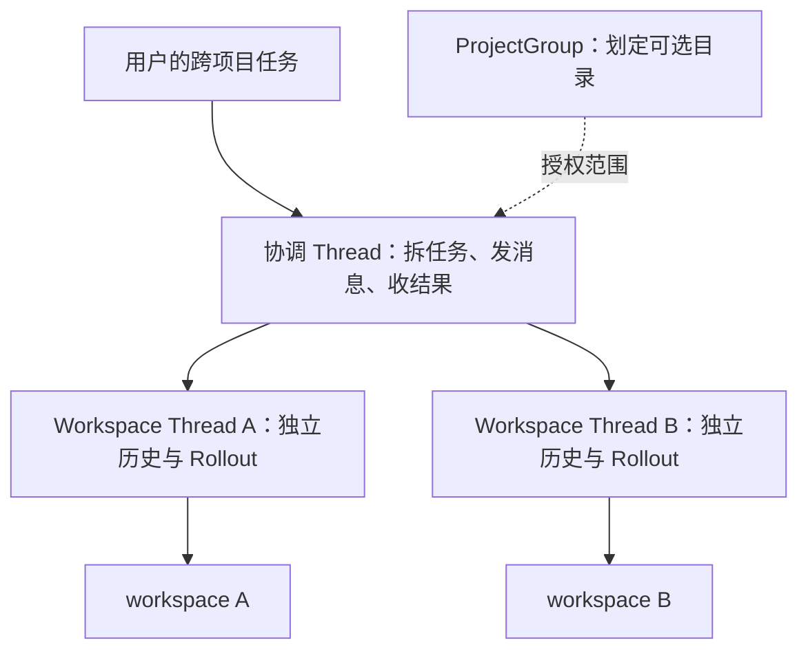
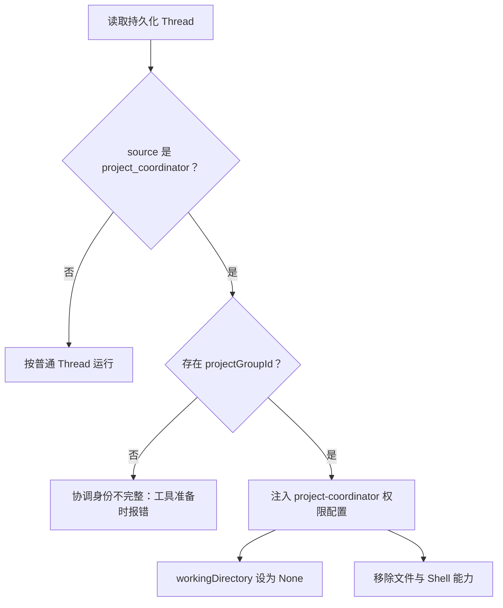
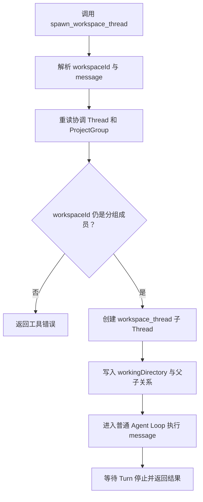
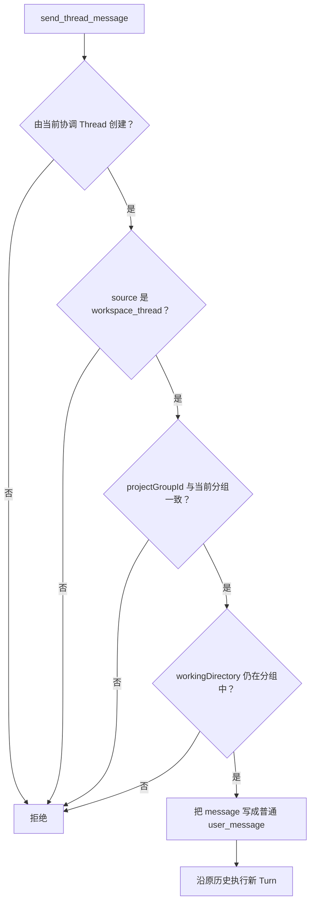
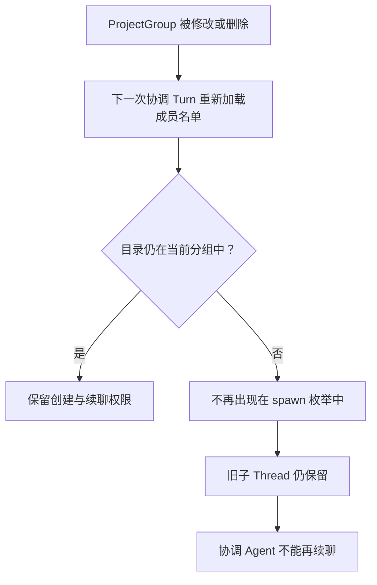

这篇文章对着 Tinybot 当前源码写，范围是 `src/project_groups.rs`、`src/agent/runtime/workspace_threads.rs` 以及它们前后的调用链。

Tinybot 要解决的问题很具体：一个任务可能同时涉及前端、后端和基础设施仓库，但普通 Agent 一次只有一个工作目录。如果让它不断切换 `cwd`，文件权限、工具上下文和会话历史很快就会搅在一起。

Tinybot 的处理方式是保留一个统一的协调会话，再为实际执行创建独立的 Workspace Thread。协调 Agent 分派任务，Workspace Thread 进目录干活。这里统一的是任务入口，不是把几个目录或几段历史拼成一个大工作区。

## 先看整体结构



协调 Thread 没有工作目录，也拿不到文件和 Shell 能力。它能做的是选择一个获准的目录，在那里创建 Thread，或者继续自己之前创建的某个 Thread。

Workspace Thread 则是普通的持久化会话。它有自己的 Thread ID、Turn 和 Rollout，文件工具与 Shell 的默认运行目录都从 `workingDirectory` 建立。Tinybot 因此不需要再造一套跨项目消息系统，原来的 Thread 和 Agent Loop 就能接住执行工作。

## ProjectGroup 是目录名单，也是授权依据

`ProjectGroup` 的数据很少：

```json
{
  "projectGroupId": "project-group-...",
  "name": "Commerce",
  "workspaceIds": [
    "D:\\code\\gateway",
    "D:\\code\\payments"
  ]
}
```

分组保存在 data root 下的 `project-groups.json`。写入之前，后端会逐个检查路径：必须存在、必须是目录，然后转成规范化绝对路径并去重。Windows 上的去重键不区分大小写。空分组不会保存，名称也不能与已有分组重复。

代码里的 `workspaceId` 其实就是路径字符串，没有单独的项目 ID。这很省事，授权时直接比较 canonical path 即可。副作用也很直白：目录一旦移动，身份就变了；同一仓库的两个 checkout 也算两个 workspace。

桌面层提供列出、保存和删除分组的命令。删除只影响 `project-groups.json`，不会碰真实目录，也不会顺手删掉已经产生的 Thread。

## 协调身份从哪里来

协调会话仍是普通的持久化 Thread，只多了两个标记：

```json
{
  "source": "project_coordinator",
  "metadata": {
    "extra": {
      "projectGroupId": "project-group-..."
    }
  }
}
```

每次开始 Turn，Bridge 都会重读 Thread，而不是相信当前请求临时带来的角色声明。身份判定走的是下面这条链路：



专用权限配置会移除 `FsWorkspaceRead`、`FsWorkspaceWrite` 和 `ShellExecute`。因此，协调 Agent 可以看到分组成员，却不能自己打开仓库、写补丁或运行命令。它只能请对应目录里的 Workspace Thread 去做。

这里有个容易写过头的安全结论：ProjectGroup 不是操作系统沙箱。

Workspace Thread 使用普通的 `local-worker` 权限。Workspace 文件 RPC 会拦住逃出 workspace root 的路径，但 Shell 仍以当前用户权限执行，也允许调用方显式传入绝对工作目录。ProjectGroup 限制的是“协调 Agent 可以把任务派到哪里”，并不保证子 Worker 永远碰不到机器上的其他路径。

## 两个工具不是静态注册的

Agent Loop 准备工具列表时，会根据当前 Thread 再查一次 ProjectGroup。普通 Thread 看不到协调工具；分组已经删除，或者成员目录全都不可用时，也不会挂载它们。

分组有效时，模型会拿到两个动态工具：

| 工具 | 输入 | 实际动作 |
| --- | --- | --- |
| `spawn_workspace_thread` | `workspaceId`、`message` | 创建持久化 Workspace Thread，发送第一条消息，等待 Turn 停止 |
| `send_thread_message` | `threadId`、`message` | 继续当前协调 Thread 创建过的 Workspace Thread，等待 Turn 停止 |

`spawn_workspace_thread` 的 schema 会把 `workspaceId` 写成当前可用成员的枚举。这个枚举主要是帮模型选对参数，真正的授权仍在工具执行时完成。

如果某个目录已经无法解析，它会从本次可选项中消失，同时留下 `project_group_workspace_unavailable` 日志。Tinybot 不会猜一个相近路径继续执行。

## 第一次分派发生了什么

`spawn_workspace_thread` 的调用链如下：



新 Thread 会记住父协调会话、所属分组和目标目录。`parentThreadId` 指向协调 Thread，`source` 固定为 `workspace_thread`；`metadata.extra` 里还会保存 `projectGroupId` 和 `workspaceThreadParentId`。模型与 provider 沿用协调 Turn 当前的选择。

Runtime 随后调用现成的 `execute_thread_turn_with_services`。子任务由此得到完整的 Thread、Turn 和 Rollout，不会随着父工具调用结束而消失。协调 Agent 发出的任务会作为普通 `user_message` 落入它的历史，用户之后还能打开、检查和继续这段会话。

父 Thread 不会复制子 Thread 的完整历史。工具只返回：

```json
{
  "threadId": "thread-workspace-...",
  "status": "completed",
  "finalMessage": "Implemented the endpoint and added tests."
}
```

这能避免子会话越跑越长，最后挤满协调 Agent 的上下文。代价是任务消息必须写清楚；如果 `finalMessage` 信息不够，协调 Agent 得用原来的 `threadId` 再问一次。

## 后续消息要重新过一遍授权

知道一个 `threadId` 还不够。`send_thread_message` 会重新读取目标 Thread，并依次检查它和当前协调会话的关系：



这几道检查防的是 Thread 劫持。另一个协调会话创建的子 Thread、同目录里的普通会话，以及已被移出分组的旧 Workspace Thread，都不能仅凭 ID 被当前协调 Agent 接管。

授权通过后，后续消息还是普通用户消息。子 Agent 沿着原历史继续，协调 Agent 只需保留 `threadId`，不必搬运它的上下文。

## 子 Turn 怎样回到父会话

Workspace Thread 的 stop reason 会折叠成四种公开状态：

| Agent Loop 停止原因 | 工具返回状态 |
| --- | --- |
| 正常返回最终文本 | `completed` |
| 等待结构化表单 | `awaiting_user` |
| 取消或中断 | `interrupted` |
| 其他错误 | `failed` |

父 Turn 会等到子 Turn 到达其中一个停止点，才拿到 `status` 和 `finalMessage`。如果状态是 `awaiting_user`，表单仍挂在子 Thread 上，需要用户进入对应会话完成或取消。协调 Agent 不能代填。

还有一个当前实现绕不开的限制：这条链路是串行的。两个 Workspace Thread 工具都不支持并行调用，而且必须是模型该次响应里唯一的工具调用。一次分派停住以后，协调 Agent 才能处理结果、安排下一次分派。它已经能统一管理多个目录，但还不是 fan-out / fan-in 调度器。

## 分组改动何时生效

下一次工具准备和每次工具执行都会重读 ProjectGroup，权限不会永远留在 Thread metadata 里。



删除分组后，协调 Thread 和 Workspace Thread 都还在，只是前者不再获得跨工作区工具。这个行为挺保守，也容易解释：历史归历史，当前授权看当前分组。

## 它和通用 Subagent 不是一回事

Tinybot 另外还有 `subagent.spawn`、mailbox 和后台任务链路。两套机制都能把工作交出去，但对象不同。

| Workspace Thread | 通用 Subagent |
| --- | --- |
| 绑定 ProjectGroup 中的具体目录 | 绑定父会话中的委派身份 |
| 任务是普通用户消息 | 输入走 subagent lifecycle 和 mailbox |
| 直接复用 Thread Turn 与 Rollout | 额外维护 Agent 控制和后台状态 |
| 用于跨目录协作 | 用于角色拆分和后台协作 |

Workspace Thread 更像一段由协调会话代为开启的正常项目会话。Subagent 更关心委派关系、运行状态和邮箱。把两者硬合成一种对象，反而会让目录授权和 Agent 生命周期纠缠在一起。

## 几个务实的取舍

### 用路径当工作区身份

好处是不用维护项目注册表，canonical path 直接就能参与授权。目录移动、挂载点变化或新建 checkout 后，ProjectGroup 必须跟着更新。

### 隔离历史，只返回摘要

Workspace Thread 只加载自己的历史和工作区上下文。协调 Agent 拿到 `finalMessage`，不会自动读取整个子会话。上下文干净了，协调消息也得写得更认真。

### 同步等待子 Turn

父 Turn 在工具调用中等待子 Turn 停止，调用关系和错误传播都很直接。缺点是长任务会占住协调链路，几个目录只能逐个处理。真要改成并行调度，还需要后台句柄、状态订阅、取消传播和结果汇合；只把 `supports_parallel_tool_calls` 改成 `true` 不够。

### 协调者不碰文件

协调 Agent 不能先扫完几个仓库再决定怎么做，它得把调查交给各自的 Workspace Thread。这会多几次模型往返，却把职责说清楚了：协调者分派，Worker 执行。仍需记住，职责分开不等于本地 Worker 已被系统级沙箱隔离。

## 源码入口

- `src/project_groups.rs`：分组的原子持久化、路径规范化和成员授权。
- `src/desktop_commands/project_groups.rs`：桌面端的分组列出、保存和删除命令。
- `src/agent/bridge/thread_flow.rs`：识别协调 Thread，并注入协调权限配置。
- `src/agent/runtime/settings.rs`：协调 Turn 不设置工作目录，选择专用 capability policy。
- `src/protocol/capability.rs`：移除文件读写和 Shell 权限。
- `src/agent/runtime/provider_loop.rs`：按当前 Thread 和分组动态挂载工具。
- `src/tools/registry/contributors.rs`：两个 Workspace Thread 工具的 schema 与运行策略。
- `src/agent/runtime/workspace_threads.rs`：创建子 Thread、发送消息、重新授权和状态投影。
- `src/agent/runtime/tool_runtime.rs`：强制 Workspace Thread 工具单独执行。
- `src/threads/workspace_store.rs`：ProjectGroup 与 Thread/Rollout 共用的持久化入口。
- `src/workspace/path_guard.rs`：Workspace 文件 RPC 的相对路径和 root 边界检查。
- `src/tools/shell/mod.rs`：Shell 工作目录解析与当前用户权限执行边界。
